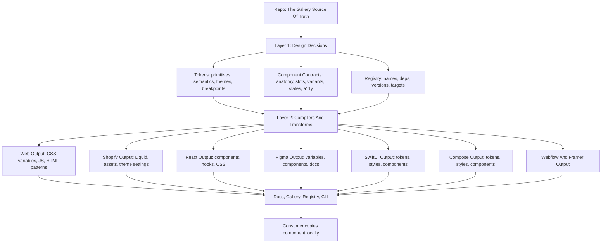
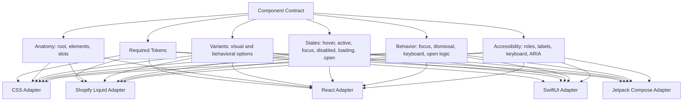

# The Gallery North Star

This is the target architecture for The Gallery. It defines where the project is going, even when the current implementation is still simpler or inconsistent.

## Definition

The Gallery is a platform-agnostic design system source of truth.

It is not just a component library, a Shopify theme, a Figma file, or a CSS bundle. It is the system that defines design decisions, component contracts, target adapters, documentation, distribution, and governance.

```text
The Gallery = tokens + component contracts + adapters + registry + docs
```

Consumers should be able to copy the pieces they need into their own project, own that code locally, and customize it freely. This follows a copy-and-own model inspired by shadcn/ui, but The Gallery is intended to be target-agnostic instead of React-only.

## Source Of Truth

The repo is the source of truth.

Targets are translations of the repo source:

- Figma is a target.
- Shopify is a target.
- Webflow is a target.
- Framer is a target.
- React, Angular, SwiftUI, Jetpack Compose, and future platforms are targets.

Root-level `*.tokens.json` files are Figma export snapshots from an earlier migration step. They are not canonical source files.

## Two Internal Languages

The Gallery needs two internal languages.

### 1. Tokens

Tokens are the language of values.

They define primitives, semantic decisions, themes, modes, breakpoints, density, typography, spacing, color, radius, shadow, motion, and other reusable design values.

The canonical token source should move toward DTCG-style JSON using `$value` and `$type`. The first source structure lives in `tokens/source/`, while the current legacy build remains stable on `tokens/*_tokens.json` until source compilers and output comparisons are ready.

### 2. Component Contracts

Component contracts are the language of components.

They define what a component is without committing to a target implementation. A contract should describe:

- Name and slug.
- Category.
- Anatomy.
- Slots.
- Variants.
- Sizes.
- States.
- Dependencies.
- Required tokens.
- Accessibility requirements.
- Behavior and progressive enhancement requirements.
- Supported target adapters.
- Documentation and examples.

A contract is not the same thing as CSS, Liquid, JSX, SwiftUI, or Compose. Those are target implementations.

Component-scoped tokens can exist when a contract needs a public customization API or a reusable component-level design decision. They should not be created for every internal implementation detail by default.

## Architecture Layers



## Layer Responsibilities

| Layer | Responsibility | Example |
| --- | --- | --- |
| 0. Governance | Decisions, standards, naming, versioning, review rules | ADRs, `AGENTS.md`, schema docs |
| 1. Token Source | Target-agnostic values | `color.gray.900`, `space.4`, `radius.md` |
| 2. Semantic Model | Intent and usage | `color.text.primary`, `surface.archival`, `space.layout.section` |
| 3. Component Contracts | Target-agnostic component definition | Button has root, label, icon, loading state |
| 4. Target Adapters | Translation rules per target | Shopify Liquid, React, SwiftUI, Compose |
| 5. Generated Outputs | Usable implementation files | `tokens.css`, `Button.tsx`, `button.liquid` |
| 6. Registry And CLI | Discovery, install, dependencies, versions | `the-gallery add button --target shopify` |
| 7. Consumer Project | Local owned code | Merchant theme, app, site, template |

## Component Contract Example



Possible outputs:

```text
Component Contract
  -> CSS classes and HTML patterns
  -> Shopify: Liquid snippets or sections
  -> React: component, hooks, styles
  -> SwiftUI: style and component files
  -> Compose: style and composable files
  -> Figma: component, variants, and variables
```

## Target Principles

- Targets do not define the design system. They consume it.
- Generated or copied outputs should be reproducible from repo source.
- A target can add platform-specific implementation details, but should not invent design decisions outside the source model.
- A target adapter can have multiple maturity strategies. For example, Shopify can ship embedded class contracts and dedicated Liquid templates in the same target.
- Target-ready means target-native: adapters must use the target's real editor, data, composition, behavior, accessibility, and distribution surfaces where those surfaces are part of the expected user experience.
- Native targets should preserve native behavior and accessibility while consuming The Gallery's tokens and contracts.
- The web/CSS implementation can be the first concrete adapter, but it should not permanently be the only component source model.

## Target Priority

Current owner-approved delivery order (2026-09-08):

1. Complete and validate the base Web system: tokens, contracts, components and docs.
2. Continue Shopify from the existing unpublished pilot.
3. Resume Figma from the preserved library pilot.

Framework, other web-platform and native adapters remain long-term targets.
Their presence in the architecture diagram is not a request to implement them
before this sequence. Figma feedback does not block base Web certification.

## What This Means For The Current Repo

The current repo already has a strong base:

- New DTCG-style token source structure in `tokens/source/`.
- Source-token compiler and migration parity checks for theme/viewport matrices.
- Neutral web token target in `platforms/web/tokens.css`, including compatibility aliases for current component CSS.
- Neutral web component adapter output in `platforms/web/index.css`, copied CSS
  modules, selective runtime loader/modules, compatibility bundles,
  `adapter.manifest.json`, and `adapter.summary.json`.
- Shopify token wrapper generated from the neutral web token target.
- Shopify adapter manifest and validation for generated/copied assets, Liquid selector inventory, and contract maturity warnings.
- First component contract schema with 182 validated contracts in `components/contracts/`, covering every component in `registry.json`: 4 are human-approved `stable`, 174 remain `pilot`, and 4 are `deprecated`.
- The docs site can render component contract metadata directly from contract source files.
- A site-owned Studio presentation schema and validated Button definition that
  reference contract properties and public tokens without duplicating source facts.
- A metadata-driven Studio inspector with Button as the first interactive preview
  renderer, using canonical component CSS rather than a documentation-only copy.
- A validated, site-only Lucide projection for Studio icon selection that leaves
  component contracts and target adapters library agnostic.
- A documentation site that consumes `platforms/web/index.css` directly, with
  shadow-root previews using generated adapter component CSS and inherited tokens.
- A responsive curatorial Exhibit composition that derives five information
  sections and one canonical artwork from existing MDX without duplicating content.
- Legacy token build files in `tokens/`.
- Component CSS in `components/css/`.
- Shopify target files in `platforms/shopify/`.
- Webflow and Framer output paths.
- Registry and CLI.
- React/Vite documentation site with MDX pages.

The remaining bridge is expanding Exhibit and Studio from the validated source
layers component by component, expanding adapter validation beyond neutral web,
tightening governance around generated outputs, distribution, and versioning, and
deciding where contracts should start generating implementation.
