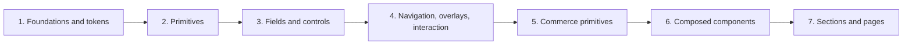

# Component Refinement Program

Generated from `registry.json`, the web certification report, dossier presence, and the small progress override file. Identity and dependencies are not duplicated here.

> A component marked ready is prepared for human review, not automatically stable.

## Summary

| Metric | Count |
| --- | ---: |
| Registry components | 182 |
| Dependency edges | 235 |
| Maximum registry dependency depth | 4 |
| Missing dependencies | 0 |
| Dependency cycles | 0 |
| Automated web gate pass | 182 |
| Dossiers present | 182 |
| Researched dossiers | 182 |
| Human-review-ready | 182 |
| Owner decisions recorded | 67 |
| Human approved | 5 |

## Review phases

The calibration batch (Button, Select, Product Card) is intentionally first. The production sequence after calibration is topological; phase priority chooses only among components whose registered dependencies are already available.

| Phase | Components |
| --- | ---: |
| 1. Foundations and tokens | 0 |
| 2. Primitives | 16 |
| 3. Fields and controls | 21 |
| 4. Navigation, overlays, and interaction | 23 |
| 5. Commerce primitives | 7 |
| 6. Composed components | 91 |
| 7. Sections and pages | 24 |

Phase 1 is a prerequisite source layer and therefore has no registry component rows. Its validated gate is `docs/reports/foundations-token-refinement-baseline.md`.

## Component matrix

| Order | Batch | Phase | Depth | ID | Component | Category | Dependencies | Auto gate | Dossier | Implementation | Evidence | Owner decision | Human | Ready |
| ---: | --- | ---: | ---: | --- | --- | --- | --- | --- | --- | --- | --- | --- | --- | --- |
| 1 | calibration | 2 | 0 | A1 | Button | primitives | none | pass | human-review-ready | accepted-existing | four-viewports-plus-special-modes | none | approved-2026-07-11 | yes |
| 2 | calibration | 3 | 0 | A3 | Select | primitives | none | pass | human-review-ready | accepted | four-viewports-plus-special-modes | none | approved-2026-08-12 | yes |
| 3 | calibration | 6 | 1 | D1 | Product Card | product | card, badge, button, price | pass | human-review-ready | accepted | four-viewports-plus-special-modes | 02/owner-decisions-recorded | approved-2026-08-12 | yes |
| 4 | phase-2 | 2 | 0 | A14 | Divider | primitives | none | pass | human-review-ready | accepted | four-viewports-plus-special-modes | none | approved-2026-08-25 | yes |
| 5 | phase-2 | 2 | 0 | B1 | Card | layout | none | pass | stable | accepted | four-viewports-plus-special-modes | none | approved-2026-08-25 | yes |
| 6 | phase-2 | 2 | 1 | A16 | Button Group | primitives | button | pass | human-review-ready | refined | four-viewports-plus-special-modes | none | pending | yes |
| 7 | phase-2 | 2 | 0 | A17 | Icon Button | primitives | none | pass | human-review-ready | refined | four-viewports-plus-special-modes | none | pending | yes |
| 8 | phase-2 | 2 | 0 | A18 | Close Button | primitives | none | pass | human-review-ready | refined | four-viewports-plus-special-modes | none | pending | yes |
| 9 | phase-2 | 2 | 0 | A19 | Toggle / Toggle Group | primitives | none | pass | human-review-ready | refined | four-viewports-plus-special-modes | none | pending | yes |
| 10 | phase-2 | 2 | 0 | A20 | FAB / Back-to-Top | primitives | none | pass | human-review-ready | refined | four-viewports-plus-special-modes | none | pending | yes |
| 11 | phase-2 | 2 | 1 | A21 | Alert / Banner | primitives | close-button | pass | human-review-ready | refined | four-viewports-plus-special-modes | none | pending | yes |
| 12 | phase-2 | 2 | 0 | A22 | Progress Bar / Circle | primitives | none | pass | human-review-ready | refined | four-viewports-plus-special-modes | 02/owner-decisions-recorded | pending | yes |
| 13 | phase-2 | 2 | 0 | A23 | Spinner | primitives | none | pass | human-review-ready | refined | four-viewports-plus-special-modes | none | pending | yes |
| 14 | phase-2 | 2 | 0 | A24 | Stat / Statistic | primitives | none | pass | human-review-ready | refined | four-viewports-plus-special-modes | none | pending | yes |
| 15 | phase-2 | 2 | 0 | A25 | Table | primitives | none | pass | human-review-ready | refined | four-viewports-plus-special-modes | none | pending | yes |
| 16 | phase-2 | 2 | 0 | A26 | Data List / Description List | primitives | none | pass | human-review-ready | refined | four-viewports-plus-special-modes | none | pending | yes |
| 17 | phase-2 | 2 | 0 | A27 | Timeline | primitives | none | pass | human-review-ready | refined | four-viewports-plus-special-modes | none | pending | yes |
| 18 | phase-2 | 2 | 0 | A28 | Link | primitives | none | pass | human-review-ready | refined | four-viewports-plus-special-modes | none | pending | yes |
| 19 | phase-3 | 3 | 0 | A2 | Input | primitives | none | pass | human-review-ready | refined | four-viewports-plus-special-modes | none | pending | yes |
| 20 | phase-3 | 3 | 1 | A4 | Textarea | primitives | input | pass | human-review-ready | refined | four-viewports-plus-special-modes | none | pending | yes |
| 21 | phase-3 | 3 | 0 | A5 | Checkbox | primitives | none | pass | human-review-ready | refined | four-viewports-plus-special-modes | none | pending | yes |
| 22 | phase-3 | 3 | 0 | A6 | Radio | primitives | none | pass | human-review-ready | refined | four-viewports-plus-special-modes | none | pending | yes |
| 23 | phase-3 | 3 | 0 | A10 | Quantity Selector | primitives | none | pass | human-review-ready | refined | four-viewports-plus-special-modes | none | pending | yes |
| 24 | phase-3 | 3 | 0 | H1 | Switch / Toggle | forms | none | pass | human-review-ready | refined | four-viewports-plus-special-modes | none | pending | yes |
| 25 | phase-3 | 3 | 0 | H2 | Slider / Range | forms | none | pass | human-review-ready | refined | four-viewports-plus-special-modes | none | pending | yes |
| 26 | phase-3 | 3 | 1 | H3 | Combobox / Autocomplete | forms | input | pass | human-review-ready | refined | four-viewports-plus-special-modes | none | pending | yes |
| 27 | phase-3 | 3 | 1 | H4 | Date Picker | forms | input | pass | human-review-ready | refined | four-viewports-plus-special-modes | none | pending | yes |
| 28 | phase-3 | 3 | 0 | H5 | Color Picker / Swatch | forms | none | pass | human-review-ready | refined | four-viewports-plus-special-modes | none | pending | yes |
| 29 | phase-3 | 3 | 0 | H6 | File Upload / Dropzone | forms | none | pass | human-review-ready | refined | four-viewports-plus-special-modes | none | pending | yes |
| 30 | phase-3 | 3 | 0 | H9 | Segmented Control | forms | none | pass | human-review-ready | refined | four-viewports-plus-special-modes | none | pending | yes |
| 31 | phase-3 | 3 | 0 | H10 | Field Wrapper | forms | none | pass | human-review-ready | refined | four-viewports-plus-special-modes | none | pending | yes |
| 32 | phase-3 | 3 | 1 | H7 | Pin Input / OTP | forms | field-wrapper | pass | human-review-ready | refined | four-viewports-plus-special-modes | 01/owner-decisions-recorded | pending | yes |
| 33 | phase-3 | 3 | 0 | H11 | Fieldset | forms | none | pass | human-review-ready | refined | four-viewports-plus-special-modes | none | pending | yes |
| 34 | phase-3 | 3 | 0 | H12 | Inline Error | forms | none | pass | human-review-ready | refined | four-viewports-plus-special-modes | none | pending | yes |
| 35 | phase-3 | 3 | 1 | H13 | Password Input | forms | input | pass | human-review-ready | refined | four-viewports-plus-special-modes | none | pending | yes |
| 36 | phase-3 | 3 | 0 | H14 | Number Input | forms | none | pass | human-review-ready | refined | four-viewports-plus-special-modes | none | pending | yes |
| 37 | phase-3 | 3 | 1 | H15 | Form | forms | field-wrapper, button | pass | human-review-ready | refined | four-viewports-plus-special-modes | none | pending | yes |
| 38 | phase-4 | 4 | 1 | B2 | Modal | layout | button, close-button | pass | human-review-ready | refined | four-viewports-plus-special-modes | none | pending | yes |
| 39 | phase-4 | 4 | 1 | B3 | Drawer | layout | button, close-button | pass | human-review-ready | refined | four-viewports-plus-special-modes | none | pending | yes |
| 40 | phase-4 | 4 | 1 | B4 | Toast | layout | button, close-button | pass | human-review-ready | refined | four-viewports-plus-special-modes | none | pending | yes |
| 41 | phase-4 | 4 | 0 | B5 | Tooltip | layout | none | pass | human-review-ready | refined | four-viewports-plus-special-modes | none | pending | yes |
| 42 | phase-4 | 4 | 0 | B6 | Accordion | layout | none | pass | human-review-ready | refined | four-viewports-plus-special-modes | none | pending | yes |
| 43 | phase-4 | 4 | 0 | B7 | Tabs | layout | none | pass | human-review-ready | refined | four-viewports-plus-special-modes | none | pending | yes |
| 44 | phase-4 | 4 | 0 | B8 | Breadcrumb | layout | none | pass | human-review-ready | refined | four-viewports-plus-special-modes | none | pending | yes |
| 45 | phase-4 | 4 | 1 | C1 | Header | global | button | pass | human-review-ready | refined | four-viewports-plus-special-modes | none | pending | yes |
| 46 | phase-4 | 4 | 0 | C3 | Footer | global | none | pass | human-review-ready | refined | four-viewports-plus-special-modes | none | pending | yes |
| 47 | phase-4 | 4 | 2 | C4 | Mobile Menu | global | drawer | pass | human-review-ready | refined | four-viewports-plus-special-modes | none | pending | yes |
| 48 | phase-4 | 4 | 1 | C5 | Search Overlay | global | close-button | pass | human-review-ready | refined | four-viewports-plus-special-modes | none | pending | yes |
| 49 | phase-4 | 4 | 0 | B9 | Popover | layout | none | pass | human-review-ready | refined | four-viewports-plus-special-modes | none | pending | yes |
| 50 | phase-4 | 4 | 0 | B11 | Dropdown Menu | layout | none | pass | human-review-ready | refined | four-viewports-plus-special-modes | none | pending | yes |
| 51 | phase-4 | 4 | 1 | B12 | Context Menu | layout | dropdown-menu | pass | human-review-ready | refined | four-viewports-plus-special-modes | none | pending | yes |
| 52 | phase-4 | 4 | 2 | B13 | Command Palette | layout | modal | pass | human-review-ready | refined | four-viewports-plus-special-modes | none | pending | yes |
| 53 | phase-4 | 4 | 0 | B14 | Steps / Stepper | layout | none | pass | human-review-ready | refined | four-viewports-plus-special-modes | none | pending | yes |
| 54 | phase-4 | 4 | 1 | B15 | Carousel / Slider | layout | icon-button | pass | human-review-ready | refined | four-viewports-plus-special-modes | none | pending | yes |
| 55 | phase-4 | 4 | 0 | B16 | Scroll Area | layout | none | pass | human-review-ready | refined | four-viewports-plus-special-modes | none | pending | yes |
| 56 | phase-4 | 4 | 2 | B17 | Lightbox | layout | modal, close-button, icon-button | pass | human-review-ready | refined | four-viewports-plus-special-modes | none | pending | yes |
| 57 | phase-4 | 4 | 0 | C7 | Mega Menu | global | none | pass | human-review-ready | refined | four-viewports-plus-special-modes | none | pending | yes |
| 58 | phase-4 | 4 | 0 | C8 | Bottom Navigation Bar | global | none | pass | human-review-ready | refined | four-viewports-plus-special-modes | none | pending | yes |
| 59 | phase-5 | 5 | 0 | A7 | Badge | primitives | none | pass | human-review-ready | refined | four-viewports-plus-special-modes | none | pending | yes |
| 60 | phase-5 | 5 | 0 | A8 | Tag | primitives | none | pass | human-review-ready | refined | four-viewports-plus-special-modes | none | pending | yes |
| 61 | phase-3 | 3 | 1 | H8 | Tags Input | forms | field-wrapper, tag | pass | human-review-ready | refined | four-viewports-plus-special-modes | none | pending | yes |
| 62 | phase-5 | 5 | 0 | A9 | Price | primitives | none | pass | human-review-ready | refined | four-viewports-plus-special-modes | none | pending | yes |
| 63 | phase-5 | 5 | 0 | A11 | Rating Stars | primitives | none | pass | human-review-ready | refined | four-viewports-plus-special-modes | 02/owner-decisions-recorded | pending | yes |
| 64 | phase-5 | 5 | 0 | A12 | Loading Skeleton | primitives | none | pass | human-review-ready | refined | four-viewports-plus-special-modes | none | pending | yes |
| 65 | phase-5 | 5 | 0 | A13 | Empty State | primitives | none | pass | human-review-ready | refined | four-viewports-plus-special-modes | 02/owner-decisions-recorded | pending | yes |
| 66 | phase-5 | 5 | 0 | A15 | Avatar | primitives | none | pass | human-review-ready | refined | four-viewports-plus-special-modes | 02/owner-decisions-recorded | pending | yes |
| 67 | phase-6 | 6 | 3 | D2 | Product Gallery | product | button, badge, icon-button, lightbox | pass | human-review-ready | refined | four-viewports-plus-special-modes | 02/owner-decisions-recorded | pending | yes |
| 68 | phase-6 | 6 | 1 | D3 | Product Info | product | price | pass | human-review-ready | refined | four-viewports-plus-special-modes | 02/owner-decisions-recorded | pending | yes |
| 69 | phase-6 | 6 | 0 | D4 | Variant Selector | product | none | pass | human-review-ready | refined | four-viewports-plus-special-modes | 02/owner-decisions-recorded | pending | yes |
| 70 | phase-6 | 6 | 1 | D5 | Product Form | product | button, quantity-selector, variant-selector | pass | human-review-ready | refined | four-viewports-plus-special-modes | 02/owner-decisions-recorded | pending | yes |
| 71 | phase-6 | 6 | 2 | D6 | Product Slider | product | carousel, icon-button, product-card | pass | human-review-ready | refined | four-viewports-plus-special-modes | none | pending | yes |
| 72 | phase-6 | 6 | 0 | E1 | Collection Hero | collection | none | pass | human-review-ready | refined | four-viewports-plus-special-modes | none | pending | yes |
| 73 | phase-6 | 6 | 2 | E2 | Collection Grid | collection | product-card | pass | human-review-ready | refined | four-viewports-plus-special-modes | none | pending | yes |
| 74 | phase-6 | 6 | 2 | E3 | Filter Panel | collection | drawer, button, checkbox, radio, input, tag | pass | human-review-ready | refined | four-viewports-plus-special-modes | 02/owner-decisions-recorded | pending | yes |
| 75 | phase-6 | 6 | 1 | E4 | Pagination | collection | link | pass | human-review-ready | refined | four-viewports-plus-special-modes | none | pending | yes |
| 76 | phase-6 | 6 | 1 | F1 | Artist Profile | storytelling | button | pass | human-review-ready | refined | four-viewports-plus-special-modes | none | pending | yes |
| 77 | phase-6 | 6 | 0 | F2 | Process Timeline | storytelling | none | pass | human-review-ready | refined | four-viewports-plus-special-modes | none | pending | yes |
| 78 | phase-6 | 6 | 0 | F3 | Certificate of Authenticity | storytelling | none | pass | human-review-ready | refined | four-viewports-plus-special-modes | none | pending | yes |
| 79 | phase-6 | 6 | 0 | F4 | Collection Story | storytelling | none | pass | human-review-ready | refined | four-viewports-plus-special-modes | none | pending | yes |
| 80 | phase-6 | 6 | 0 | F5 | Masonry Gallery | storytelling | none | pass | human-review-ready | refined | four-viewports-plus-special-modes | none | pending | yes |
| 81 | phase-6 | 6 | 2 | G1 | Hero | marketing | button, icon-button, carousel | pass | human-review-ready | refined | four-viewports-plus-special-modes | 01/owner-decisions-recorded | pending | yes |
| 82 | phase-6 | 6 | 1 | G2 | Newsletter Signup | marketing | input, button | pass | human-review-ready | refined | four-viewports-plus-special-modes | 03/owner-decisions-recorded | pending | yes |
| 83 | phase-6 | 6 | 1 | G3 | Testimonials | marketing | avatar | pass | human-review-ready | refined | four-viewports-plus-special-modes | none | pending | yes |
| 84 | phase-6 | 6 | 1 | G4 | Popup (deprecated) | marketing | popover | pass | human-review-ready | refined | four-viewports-plus-special-modes | 01/owner-decisions-recorded | pending | yes |
| 85 | phase-6 | 6 | 0 | G5 | Trust Badges | marketing | none | pass | human-review-ready | refined | four-viewports-plus-special-modes | none | pending | yes |
| 86 | phase-6 | 6 | 0 | G6 | Payment Icons | marketing | none | pass | human-review-ready | refined | four-viewports-plus-special-modes | none | pending | yes |
| 87 | phase-6 | 6 | 0 | G7 | Countdown | marketing | none | pass | human-review-ready | refined | four-viewports-plus-special-modes | 01/owner-decisions-recorded | pending | yes |
| 88 | phase-4 | 4 | 2 | C2 | Announcement Bar | global | link, close-button, countdown, carousel, icon-button | pass | human-review-ready | refined | four-viewports-plus-special-modes | none | pending | yes |
| 89 | phase-6 | 6 | 0 | G8 | Urgency Indicators | marketing | none | pass | human-review-ready | refined | four-viewports-plus-special-modes | 03/owner-decisions-recorded | pending | yes |
| 90 | phase-6 | 6 | 2 | G9 | Consent Manager | marketing | button, link, modal, checkbox | pass | human-review-ready | refined | four-viewports-plus-special-modes | 01/owner-decisions-recorded | pending | yes |
| 91 | phase-6 | 6 | 2 | G10 | Social Proof Notifications | marketing | toast | pass | human-review-ready | refined | four-viewports-plus-special-modes | 03/owner-decisions-recorded | pending | yes |
| 92 | phase-6 | 6 | 3 | G11 | Announcement Extended (deprecated) | marketing | announcement-bar, link, close-button, countdown, carousel, icon-button | pass | human-review-ready | refined | four-viewports-plus-special-modes | 01/owner-decisions-recorded | pending | yes |
| 93 | phase-6 | 6 | 1 | K2 | Cart Line Item | cart | button, price, quantity-selector | pass | human-review-ready | refined | four-viewports-plus-special-modes | none | pending | yes |
| 94 | phase-4 | 4 | 2 | C6 | Cart Drawer | global | drawer, cart-line-item | pass | human-review-ready | refined | four-viewports-plus-special-modes | none | pending | yes |
| 95 | phase-6 | 6 | 1 | K3 | Cart Summary | cart | button | pass | human-review-ready | refined | four-viewports-plus-special-modes | none | pending | yes |
| 96 | phase-6 | 6 | 2 | K1 | Cart Page | cart | cart-line-item, cart-summary | pass | human-review-ready | refined | four-viewports-plus-special-modes | 03/owner-decisions-recorded | pending | yes |
| 97 | phase-6 | 6 | 1 | K4 | Discount / Promo Field | cart | input, button | pass | human-review-ready | refined | four-viewports-plus-special-modes | none | pending | yes |
| 98 | phase-6 | 6 | 1 | K5 | Free Shipping Bar | cart | progress | pass | human-review-ready | refined | four-viewports-plus-special-modes | none | pending | yes |
| 99 | phase-6 | 6 | 1 | K6 | Cart Upsell | cart | button, link, price | pass | human-review-ready | refined | four-viewports-plus-special-modes | none | pending | yes |
| 100 | phase-6 | 6 | 1 | K7 | Cart Empty | cart | empty-state, button | pass | human-review-ready | refined | four-viewports-plus-special-modes | none | pending | yes |
| 101 | phase-6 | 6 | 4 | K8 | Quick View | cart | modal, product-gallery, price, product-form, link | pass | human-review-ready | refined | four-viewports-plus-special-modes | 03/owner-decisions-recorded | pending | yes |
| 102 | phase-6 | 6 | 2 | K9 | Sticky Add-to-Cart Bar | cart | button, price, product-form | pass | human-review-ready | refined | four-viewports-plus-special-modes | 03/owner-decisions-recorded | pending | yes |
| 103 | phase-6 | 6 | 2 | K10 | Cart Note | cart | textarea | pass | human-review-ready | refined | four-viewports-plus-special-modes | none | pending | yes |
| 104 | phase-6 | 6 | 1 | K11 | Gift Wrap Option | cart | checkbox, price | pass | human-review-ready | refined | four-viewports-plus-special-modes | 03/owner-decisions-recorded | pending | yes |
| 105 | phase-6 | 6 | 2 | U1 | Auth Forms (Login / Register) | account | form, field-wrapper, input, password-input, button, link, divider | pass | human-review-ready | refined | four-viewports-plus-special-modes | 03/owner-decisions-recorded | pending | yes |
| 106 | phase-6 | 6 | 2 | U2 | Password Reset | account | form, input, button, alert | pass | human-review-ready | refined | four-viewports-plus-special-modes | 03/owner-decisions-recorded | pending | yes |
| 107 | phase-6 | 6 | 1 | U3 | Account Dashboard | account | card, link, button | pass | human-review-ready | refined | four-viewports-plus-special-modes | 03/owner-decisions-recorded | pending | yes |
| 108 | phase-6 | 6 | 1 | U4 | Order History | account | link, badge | pass | human-review-ready | refined | four-viewports-plus-special-modes | 03/owner-decisions-recorded | pending | yes |
| 109 | phase-6 | 6 | 2 | U5 | Order Detail | account | steps, cart-line-item | pass | human-review-ready | refined | four-viewports-plus-special-modes | 03/owner-decisions-recorded | pending | yes |
| 110 | phase-6 | 6 | 1 | U6 | Address Book | account | badge, button | pass | human-review-ready | refined | four-viewports-plus-special-modes | 03/owner-decisions-recorded | pending | yes |
| 111 | phase-6 | 6 | 2 | U7 | Address Form | account | form, input, select, button | pass | human-review-ready | refined | four-viewports-plus-special-modes | 03/owner-decisions-recorded | pending | yes |
| 112 | phase-6 | 6 | 2 | U8 | Wishlist | account | product-card, empty-state | pass | human-review-ready | refined | four-viewports-plus-special-modes | 03/owner-decisions-recorded | pending | yes |
| 113 | phase-6 | 6 | 2 | U9 | Account Settings | account | form, input, button, switch | pass | human-review-ready | refined | four-viewports-plus-special-modes | 03/owner-decisions-recorded | pending | yes |
| 114 | phase-6 | 6 | 1 | L1 | Article Card | blog | card, badge | pass | human-review-ready | refined | four-viewports-plus-special-modes | 04/owner-decisions-recorded | pending | yes |
| 115 | phase-6 | 6 | 0 | L2 | Article Hero | blog | none | pass | human-review-ready | refined | four-viewports-plus-special-modes | 04/owner-decisions-recorded | pending | yes |
| 116 | phase-6 | 6 | 2 | L3 | Article Body / Prose | blog | product-card, price | pass | human-review-ready | refined | four-viewports-plus-special-modes | 04/owner-decisions-recorded | pending | yes |
| 117 | phase-6 | 6 | 0 | L4 | Reading Progress Bar | blog | none | pass | human-review-ready | refined | four-viewports-plus-special-modes | 01/owner-decisions-recorded | visual-placement-shopify-source-and-performance-review-pending | yes |
| 118 | phase-6 | 6 | 1 | L5 | Table of Contents | blog | link | pass | human-review-ready | refined | four-viewports-plus-special-modes | 04/owner-decisions-recorded | pending | yes |
| 119 | phase-6 | 6 | 1 | L6 | Author Card | blog | card, avatar, link | pass | human-review-ready | refined | four-viewports-plus-special-modes | 04/owner-decisions-recorded | pending | yes |
| 120 | phase-6 | 6 | 1 | L7 | Filter Bar | blog | segmented-control, checkbox | pass | human-review-ready | refined | four-viewports-plus-special-modes | 01/owner-decisions-recorded | final-visual-web-query-consumer-shopify-query-consumer-figma-and-explicit-stability-review-needed | yes |
| 121 | phase-6 | 6 | 1 | L8 | Blog Sidebar | blog | link | pass | human-review-ready | refined | four-viewports-plus-special-modes | 04/owner-decisions-recorded | pending | yes |
| 122 | phase-6 | 6 | 1 | L9 | Share Actions | blog | button | pass | human-review-ready | refined | four-viewports-plus-special-modes | 01/owner-decisions-recorded | web-shopify-consumers-provider-mappings-feedback-visual-figma-and-explicit-stability-review-needed | yes |
| 123 | phase-6 | 6 | 2 | L10 | Related Articles | blog | article-card | pass | human-review-ready | refined | four-viewports-plus-special-modes | 04/owner-decisions-recorded | pending | yes |
| 124 | phase-6 | 6 | 2 | L11 | Comment Section | blog | avatar, button, empty-state, pagination, select, textarea, toggle | pass | human-review-ready | refined | four-viewports-plus-special-modes | 04/owner-decisions-recorded | pending | yes |
| 125 | phase-6 | 6 | 1 | R1 | Material Library | ceramics | tag | pass | human-review-ready | refined | four-viewports-plus-special-modes | 04/owner-decisions-recorded | pending | yes |
| 126 | phase-6 | 6 | 0 | R2 | Glaze Guide | ceramics | none | pass | human-review-ready | refined | four-viewports-plus-special-modes | 04/owner-decisions-recorded | pending | yes |
| 127 | phase-6 | 6 | 0 | R3 | Technique Explainer | ceramics | none | pass | human-review-ready | refined | four-viewports-plus-special-modes | 04/owner-decisions-recorded | pending | yes |
| 128 | phase-6 | 6 | 0 | R4 | Care Instructions | ceramics | none | pass | human-review-ready | refined | four-viewports-plus-special-modes | 04/owner-decisions-recorded | pending | yes |
| 129 | phase-6 | 6 | 1 | R5 | Dimensions Display | ceramics | segmented-control | pass | human-review-ready | refined | four-viewports-plus-special-modes | 04/owner-decisions-recorded | pending | yes |
| 130 | phase-6 | 6 | 1 | R6 | Firing Schedule | ceramics | data-table | pass | human-review-ready | refined | four-viewports-plus-special-modes | 04/owner-decisions-recorded | pending | yes |
| 131 | phase-6 | 6 | 1 | R7 | Workshop Listing | ceramics | card, price, badge, button | pass | human-review-ready | refined | four-viewports-plus-special-modes | 04/owner-decisions-recorded | pending | yes |
| 132 | phase-6 | 6 | 2 | R8 | Commission Form | ceramics | input, textarea, file-upload, button | pass | human-review-ready | refined | four-viewports-plus-special-modes | 04/owner-decisions-recorded | pending | yes |
| 133 | phase-6 | 6 | 1 | R9 | Maker's Mark | ceramics | link | pass | human-review-ready | refined | four-viewports-plus-special-modes | 04/owner-decisions-recorded | pending | yes |
| 134 | phase-6 | 6 | 0 | R10 | Edition / Numbering | ceramics | none | pass | human-review-ready | refined | four-viewports-plus-special-modes | 04/owner-decisions-recorded | pending | yes |
| 135 | phase-6 | 6 | 2 | D7 | Size Chart | product | modal, segmented-control, data-table | pass | human-review-ready | refined | four-viewports-plus-special-modes | 02/owner-decisions-recorded | pending | yes |
| 136 | phase-6 | 6 | 1 | D8 | Back in Stock Alert | product | input, button | pass | human-review-ready | refined | four-viewports-plus-special-modes | 02/owner-decisions-recorded | pending | yes |
| 137 | phase-6 | 6 | 1 | D9 | Pickup Location Selector | product | input, button, radio | pass | human-review-ready | refined | four-viewports-plus-special-modes | 02/owner-decisions-recorded | pending | yes |
| 138 | phase-6 | 6 | 1 | D9a | Store Locator | product | input, button, link | pass | human-review-ready | refined | four-viewports-plus-special-modes | 02/owner-decisions-recorded | pending | yes |
| 139 | phase-6 | 6 | 1 | D10 | Subscription / Recurring Option | product | fieldset, radio, price, badge | pass | human-review-ready | refined | four-viewports-plus-special-modes | 02/owner-decisions-recorded | pending | yes |
| 140 | phase-6 | 6 | 1 | E5 | Grid / List View Toggle | collection | segmented-control | pass | human-review-ready | refined | four-viewports-plus-special-modes | 02/owner-decisions-recorded | pending | yes |
| 141 | phase-6 | 6 | 3 | E6 | Collection Promo Tile | collection | collection-grid, link | pass | human-review-ready | refined | four-viewports-plus-special-modes | 02/owner-decisions-recorded | pending | yes |
| 142 | phase-6 | 6 | 1 | E7 | Empty Collection State | collection | empty-state, button, link | pass | human-review-ready | refined | four-viewports-plus-special-modes | 02/owner-decisions-recorded | pending | yes |
| 143 | phase-6 | 6 | 0 | F6 | Artist Index Grid | storytelling | none | pass | human-review-ready | refined | four-viewports-plus-special-modes | none | pending | yes |
| 144 | phase-6 | 6 | 1 | F6a | Artist Card | storytelling | card, badge | pass | human-review-ready | refined | four-viewports-plus-special-modes | none | pending | yes |
| 145 | phase-6 | 6 | 0 | F7 | Exhibition Landing Page | storytelling | none | pass | human-review-ready | refined | four-viewports-plus-special-modes | none | pending | yes |
| 146 | phase-6 | 6 | 0 | F8 | Artist Statement Section | storytelling | none | pass | human-review-ready | refined | four-viewports-plus-special-modes | none | pending | yes |
| 147 | phase-6 | 6 | 1 | V1 | Review Summary | reviews | rating | pass | human-review-ready | refined | four-viewports-plus-special-modes | none | pending | yes |
| 148 | phase-6 | 6 | 1 | V2 | Star Rating (Display) (deprecated) | reviews | rating | pass | human-review-ready | deprecated-migrated | four-viewports-plus-special-modes | 02/owner-decisions-recorded | not-applicable-deprecated-migration | yes |
| 149 | phase-6 | 6 | 0 | V3 | Star Rating (Interactive) | reviews | none | pass | human-review-ready | refined | four-viewports-plus-special-modes | none | pending | yes |
| 150 | phase-6 | 6 | 1 | V4 | Review | reviews | rating | pass | human-review-ready | refined | four-viewports-plus-special-modes | none | pending | yes |
| 151 | phase-6 | 6 | 0 | V5 | Review Highlights / Themes | reviews | none | pass | human-review-ready | refined | four-viewports-plus-special-modes | none | pending | yes |
| 152 | phase-6 | 6 | 0 | V6 | Photo Reviews Gallery | reviews | none | pass | human-review-ready | refined | four-viewports-plus-special-modes | none | pending | yes |
| 153 | phase-6 | 6 | 2 | V7 | Write-a-Review Form | reviews | star-input, input, textarea, file-upload, select, button | pass | human-review-ready | refined | four-viewports-plus-special-modes | none | pending | yes |
| 154 | phase-6 | 6 | 1 | V8 | Review Sort / Filter Bar | reviews | select, button | pass | human-review-ready | refined | four-viewports-plus-special-modes | none | pending | yes |
| 155 | phase-6 | 6 | 2 | V9 | Review Pagination | reviews | pagination | pass | human-review-ready | refined | four-viewports-plus-special-modes | none | pending | yes |
| 156 | phase-6 | 6 | 1 | R12 | Ceramics Glossary | ceramics | accordion, link | pass | human-review-ready | refined | four-viewports-plus-special-modes | none | pending | yes |
| 157 | phase-6 | 6 | 1 | R13 | Studio Tour Section | ceramics | process-timeline | pass | human-review-ready | refined | four-viewports-plus-special-modes | none | pending | yes |
| 158 | phase-6 | 6 | 1 | R14 | Ceramics Care FAQ | ceramics | accordion, link | pass | human-review-ready | refined | four-viewports-plus-special-modes | none | pending | yes |
| 159 | phase-7 | 7 | 1 | X1 | Coming Soon | pages | input, button, link | pass | human-review-ready | refined | four-viewports-plus-special-modes | none | pending | yes |
| 160 | phase-7 | 7 | 2 | S1 | Hero Section | sections | button, icon-button, carousel | pass | human-review-ready | refined | four-viewports-plus-special-modes | 04/owner-decisions-recorded | pending | yes |
| 161 | phase-7 | 7 | 3 | S2 | Featured Collection | sections | link, carousel, product-card, collection-grid | pass | human-review-ready | refined | four-viewports-plus-special-modes | none | pending | yes |
| 162 | phase-7 | 7 | 1 | S3 | Image with Text | sections | button | pass | human-review-ready | refined | four-viewports-plus-special-modes | none | pending | yes |
| 163 | phase-7 | 7 | 0 | S4 | Multicolumn | sections | none | pass | human-review-ready | refined | four-viewports-plus-special-modes | none | pending | yes |
| 164 | phase-7 | 7 | 0 | S5 | Gallery Grid | sections | none | pass | human-review-ready | refined | four-viewports-plus-special-modes | none | pending | yes |
| 165 | phase-7 | 7 | 0 | S6 | Lookbook | sections | none | pass | human-review-ready | refined | four-viewports-plus-special-modes | none | pending | yes |
| 166 | phase-7 | 7 | 0 | S7 | Video Section | sections | none | pass | human-review-ready | refined | four-viewports-plus-special-modes | none | pending | yes |
| 167 | phase-7 | 7 | 2 | S8 | Brand Story | sections | image-text | pass | human-review-ready | refined | four-viewports-plus-special-modes | none | pending | yes |
| 168 | phase-7 | 7 | 1 | S9 | FAQ Section | sections | accordion | pass | human-review-ready | refined | four-viewports-plus-special-modes | none | pending | yes |
| 169 | phase-7 | 7 | 2 | S10 | Contact Form | sections | input, textarea, button | pass | human-review-ready | refined | four-viewports-plus-special-modes | none | pending | yes |
| 170 | phase-7 | 7 | 1 | S11 | Stats Counter | sections | stat | pass | human-review-ready | refined | four-viewports-plus-special-modes | none | pending | yes |
| 171 | phase-7 | 7 | 1 | S13 | Comparison Table | sections | data-table, radio, checkbox, link, button | pass | human-review-ready | refined | four-viewports-plus-special-modes | 04/owner-decisions-recorded | pending | yes |
| 172 | phase-7 | 7 | 0 | S14 | Shipping Info | sections | none | pass | human-review-ready | refined | four-viewports-plus-special-modes | none | pending | yes |
| 173 | phase-7 | 7 | 0 | S15 | Rich Text Section | sections | none | pass | human-review-ready | refined | four-viewports-plus-special-modes | none | pending | yes |
| 174 | phase-7 | 7 | 0 | S16 | Instagram Feed | sections | none | pass | human-review-ready | refined | four-viewports-plus-special-modes | none | pending | yes |
| 175 | phase-7 | 7 | 1 | S17 | Before / After Image Slider | sections | slider | pass | human-review-ready | refined | four-viewports-plus-special-modes | 01/owner-decisions-recorded | pending | yes |
| 176 | phase-7 | 7 | 1 | S18 | Scrolling Text Marquee | sections | button | pass | human-review-ready | refined | four-viewports-plus-special-modes | 01/owner-decisions-recorded | pending | yes |
| 177 | phase-7 | 7 | 2 | S12 | Logo Bar / Trust Bar | sections | marquee | pass | human-review-ready | refined | four-viewports-plus-special-modes | 01/owner-decisions-recorded | pending | yes |
| 178 | phase-7 | 7 | 0 | S19 | Collage Section | sections | none | pass | human-review-ready | refined | four-viewports-plus-special-modes | none | pending | yes |
| 179 | phase-7 | 7 | 1 | P1 | 404 Page | pages | empty-state, input, button, link | pass | human-review-ready | refined | four-viewports-plus-special-modes | none | pending | yes |
| 180 | phase-7 | 7 | 1 | P2 | Gift Card Page | pages | button, input | pass | human-review-ready | refined | four-viewports-plus-special-modes | none | pending | yes |
| 181 | phase-7 | 7 | 1 | P3 | Policy Page Template | pages | link | pass | human-review-ready | refined | four-viewports-plus-special-modes | none | pending | yes |
| 182 | phase-7 | 7 | 1 | P4 | Checkout Progress Indicator | pages | steps | pass | human-review-ready | refined | four-viewports-plus-special-modes | none | pending | yes |

## Graph integrity

- Missing registry dependencies: none.
- Cycles: none.
- Unknown progress overrides: none.
- Progress integrity errors: none.
- Owner decisions recorded: 67 of 67 covered components. 0 remain outside the human-review queue while their accepted direction is reconciled. Packet proposal codes remain historical; accepted directions live in `docs/refinement/owner-decision-responses.md`.
- The complete machine-readable adjacency list and review order live in the JSON companion. The Graphviz source is `docs/reports/component-dependency-graph.dot`.

## Interpretation

- A zero-dependency registry entry is a source fact, not proof that the component has no semantic composition. Each dossier must reconcile canonical dependency use before human review.
- `mobile-desktop-baseline` records the existing Exhibit/Studio sweep. The expanded rubric additionally requires Tablet and XL.
- Open target-owned services may remain deferred when their boundary is explicit. Open product, aesthetic, commercial, or architecture choices remain blocking.
- No report generator may change a contract status.
